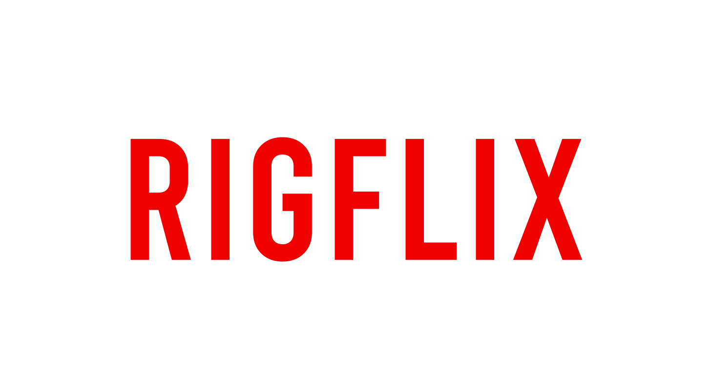
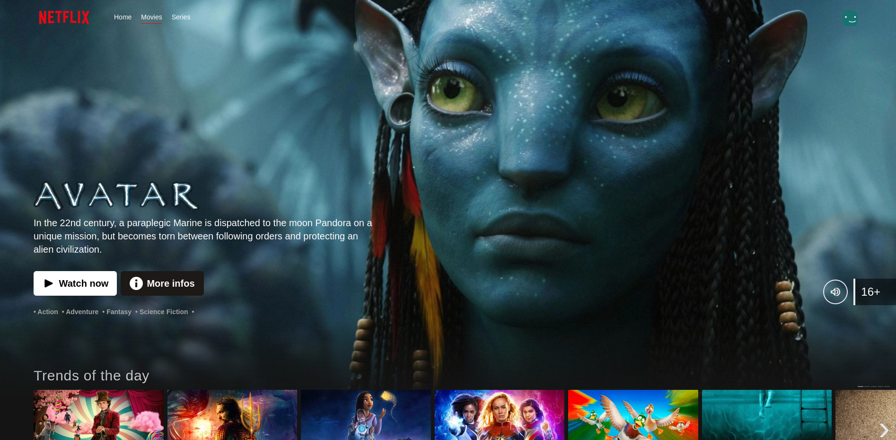

# 
  

Welcome to the Netflix Clone project! This project is a web application built with Next.js that mimics the core functionalities of Netflix. 
It allows users to browse and search for movies and TV shows using the API from TheMovieDB (TMDb).

## I'm looking for clients 
I'm a website developer and I'm currently looking for clients. If you like my work and want to collaborate, please get in touch!

My website : [nebula.li](https://www.nebula.li)
